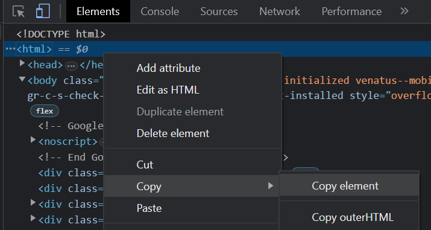

# pancake

Known for somewhat solving [Wordle](https://www.nytimes.com/games/wordle/index.html) and [Waffle](https://wafflegame.net/).

## Disclaimer
Only Windows and Linux are supported as of now. Windows because I use it, Linux because GitHub Actions uses it (**but not my Ubuntu terminal somehow**). You can't fight me.

## Usage
1. Run `setup.py`.
1. To solve the ongoing Waffle, run `main.py` as is since the whole process is automated.
    - Use `python main.py 1` for daily Waffle and `python main.py 2` for deluxe Waffle.
    - If the mode is not given, it will request for one, 1 or 2, depending on whether you want to solve the daily Waffle or deluxe Waffle.
1. If you decide to not solve the ongoing Waffle, run `local_html.py` instead. For any number of times, copy your whole HTML page source to `run.html` and press Enter.

Note that you can't get the HTML source page via `Ctrl+U`, so here's how you can do it:

## How it works

I only learnt CS2040 and CS3243, so those are where this can go as far as.

## Contributing

asdf